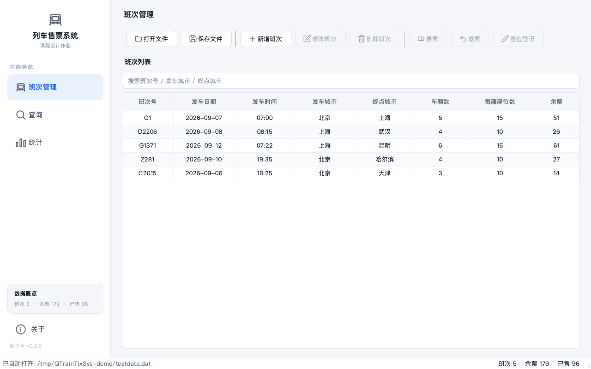
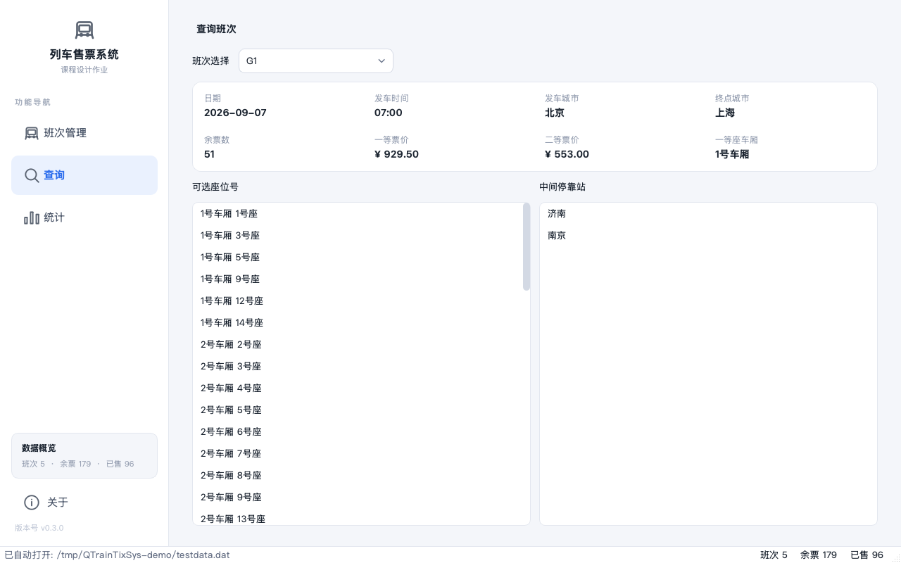
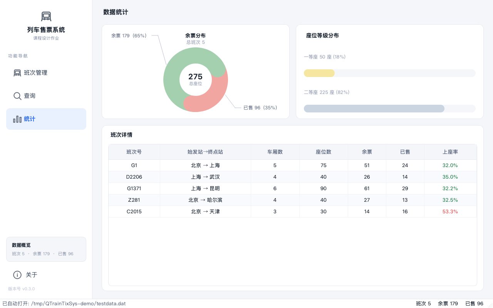
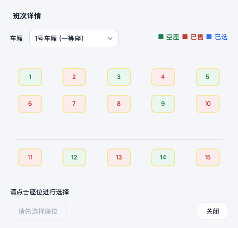
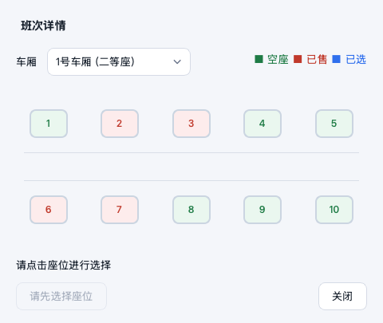

<div align="center">



</div>

## QTrainTixSys · 列车客运售票管理系统

> **一个基于 Qt 6 Widgets 的列车售票桌面应用，从查询、选座到出票的完整购票闭环。**
>
> 自绘环形图 · 仿真磁介质车票 · 可视化选座 · 零第三方依赖


---

## 目录

- [项目简介](#项目简介)
- [核心功能](#核心功能)
- [界面预览](#界面预览)
- [快速开始](#快速开始)
- [技术架构](#技术架构)
- [项目结构](#项目结构)
- [测试](#测试)
- [文档](#文档)
- [License](#license)

---

## 项目简介

QTrainTixSys 是一个用纯 Qt 6 Widgets 构建的列车客运售票管理系统：不依赖 QML、不依赖任何第三方库，界面全部由 QWidget + QSS + QPainter 完成。数据层与界面层严格分离——`Seat` / `Train` / `TrainSystem` 三个类构成可独立测试的内核，UI 组件只做展示与交互。

系统覆盖售票业务全流程：班次维护、按车厢可视化选座售票、点座退票、余票查询、运营统计。售票成功会弹出一张参照 12306 磁介质真票自绘的仿真车票，可另存为含订单与支付凭据的电子客票。

## 核心功能

| 模块 | 说明 |
|------|------|
| **班次管理** | 新增 / 删除 / 修改班次，改号查重、缩编组拦截已售座位；列头点击排序，数值列按数值比较 |
| **可视化选座售票** | 圆角座位按钮网格，空座绿 / 已售红 / 已选蓝三态，一等座金色描边；座位图按排绘制过道示意 |
| **仿真磁介质车票** | 全 QPainter 自绘 880×430 票面：浅蓝底纹、红字票号、站名拼音、动车组剪影水印、齿孔撕边、伪二维码，含订单号与支付凭据 |
| **退票** | 点击已售座位即退，状态实时刷新 |
| **余票查询** | 独立查询页：班次概况、按车厢列出可选座位号、中间停靠站；点击座位查看周边分布 |
| **数据统计** | 余票分布环形图（入场逐段展开动画 + 悬停弹性加粗）+ 座位等级分布条 + 分班次上座率表格 |
| **搜索过滤** | 按班次号 / 城市关键字实时过滤 |
| **输入校验** | 时间 HH:MM、日期 YYYY-MM-DD、身份证 18 位格式校验；界面与导出统一身份证脱敏 |
| **数据持久化** | `.dat` 文本格式读写，新版兼容旧版无日期 / 票价文件；关闭时保存 / 不保存 / 取消三态提示 |
| **窗口记忆** | 重启恢复窗口几何，自动打开上次的数据文件 |

## 界面预览

**余票查询** 与 **数据统计**（环形图带入场动画与悬停弹性加粗交互）：

| 查询余票 | 数据统计 |
|---|---|
|  |  |

**仿真磁介质车票**（售票成功弹出，可保存为电子客票 txt）：


**班次详情座位图**（一等座金色描边，排间绘制过道示意）：

| 15 座 · 三排（过道在二三排之间） | 10 座 · 两排（过道居中） |
|---|---|
|  |  |

## 快速开始

环境要求：**Qt ≥ 6.2**、**CMake ≥ 3.16**、**Ninja**（或 Make）。

```bash
# 1. 配置（DCMAKE_PREFIX_PATH 指向本机 Qt 安装目录）
cmake -S . -B build -G Ninja \
  -DCMAKE_PREFIX_PATH=/path/to/Qt/6.x.x/macos

# 2. 编译
cmake --build build

# 3. 运行（macOS 生成 .app）
open build/列车售票系统.app

# 4. 单元测试
ctest --test-dir build --output-on-failure
```

首次启动后：顶部「打开」→ 选择仓库内的 `testdata.dat`（内置 5 个班次的示例数据）即可体验全部功能。

## 技术架构

```
┌────────────────────────────────────────────────┐
│                  MainWindow（调度）              │
│        侧边栏导航 · 顶部操作栏 · 页面切换动画        │
├──────────────┬──────────────┬──────────────────┤
│  班次管理页    │   查询页      │     统计页        │
│ TrainListView │  QueryPage   │  StatisticsPage  │
│  搜索·排序·空态 │ 余票·选座·停靠 │  DonutChart 环形图 │
├──────────────┴──────────────┴──────────────────┤
│              对话框层（FadeDialog 淡入基类）        │
│   售票/退票 · 座位登记 · 班次详情 · 新增班次 · 车票   │
├────────────────────────────────────────────────┤
│          自绘组件：DonutChart · TicketCard        │
│     QPainter + QPropertyAnimation（弹性缓动）      │
├────────────────────────────────────────────────┤
│                  数据层（可独立测试）              │
│   Seat（座位/旅客）→ Train（班次/售票退票/校验）    │
│   → TrainSystem（集合管理 + .dat 读写 + 旧版兼容）  │
└────────────────────────────────────────────────┘
```

- **分层解耦**：数据层不包含任何 UI 代码，`tests/` 直接对数据层做单元测试与文件读写往返回归。
- **全自绘可视化**：统计环形图（`DonutChart`）与仿真车票（`TicketCard`）均由 QPainter 逐像素绘制，动画使用 `QPropertyAnimation` + 自定义 OutBack 弹性缓动。
- **组件复用**：座位网格在售票/退票、班次详情、座位登记三处复用同一套绘制与过道规则；`tableutil.h` 提供居中条目、权重列宽等表格工具。
- **统一主题**：`theme.qss` 全局浅色扁平主题（品牌蓝 `#2F6FED`），色值常量收敛于 `palette.h`。

## 项目结构

```
QTrainTixSys/
├── seat.h/cpp               # 座位类：旅客信息（姓名/身份证/车厢/座位号）
├── train.h/cpp              # 班次类：班次信息 + 座位集合 + 售票/退票 + 校验
├── trainsystem.h/cpp        # 系统类：班次集合 + .dat 读写（旧格式向后兼容）
├── mainwindow.h/cpp/ui      # 主窗口：导航 + 操作栏 + 页面调度 + 窗口记忆
├── sidebarwidget.h/cpp      # 左侧导航栏：品牌区 + 页面导航 + 数据概览
├── trainlistview.h/cpp      # 班次列表：搜索 + 排序 + 实时过滤 + 空状态
├── querypage.h/cpp/ui       # 查询页：余票 / 可选座位 / 停靠站
├── statisticspage.h/cpp     # 统计页：环形图 + 等级分布 + 上座率表格
├── donutchart.h/cpp         # 自绘环形图：展开动画 + 弹性悬停 + 注释线
├── ticketcard.h/cpp         # 仿真磁介质车票自绘卡片
├── ticketview.h/cpp/ui      # 车票展示对话框（可保存电子客票）
├── ticketdialog.h/cpp/ui    # 售票/退票对话框（可视化选座）
├── seattableview.h/cpp      # 座位登记表组件
├── seattabledialog.h/cpp    # 座位登记弹窗
├── seatmappopup.h/cpp       # 座位周边分布浮窗
├── addtraindialog.h/cpp/ui  # 新增/修改班次对话框
├── selldialog.h/cpp         # 售票入口对话框
├── refunddialog.h/cpp       # 退票入口对话框
├── registerdialog.h/cpp     # 旅客信息登记对话框
├── fadedialog.h/cpp         # 对话框淡入基类
├── palette.h                # 全局色值常量
├── tableutil.h              # 表格 UI 工具
├── theme.qss                # 全局浅色扁平主题
├── resources.qrc + icons/   # 资源清单 + 线性 SVG 图标
├── tests/                   # Qt Test 单元测试（数据层 + 文件往返）
├── testdata.dat             # 示例数据（5 班次，覆盖边界用例）
├── CODE_GUIDE.md            # 逐文件逐函数代码详解
├── PROGRESS.md              # 迭代计划与进度记录
└── CMakeLists.txt           # 构建配置（主程序 + 两个测试目标）
```

## 测试

数据层单元测试基于 **Qt Test**，由 CMake/CTest 驱动，覆盖：

- Seat / Train 的售票、退票、重复售票拦截与输入校验
- TrainSystem 文件读写往返无损（含旧格式兼容回归）
- 修改班次的三步保护（改号查重 / 缩编组拦截 / 售座迁移）

```bash
ctest --test-dir build --output-on-failure
```

## 文档

- [CODE_GUIDE.md](CODE_GUIDE.md) — 逐文件逐函数的代码详解（实现方式 + 依赖关系）
- [PROGRESS.md](PROGRESS.md) — 迭代计划与版本进度记录

## License

暂未正式选取，发布前建议选用 [MIT](https://opensource.org/licenses/MIT) 等宽松许可。

---

❝ 从查询到出票，一段旅程从这里开始。❞
